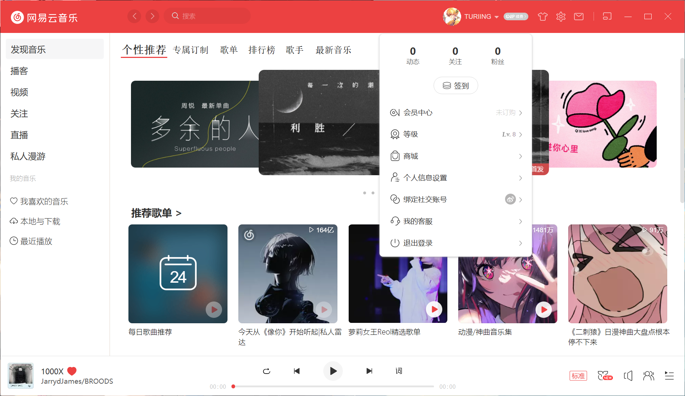
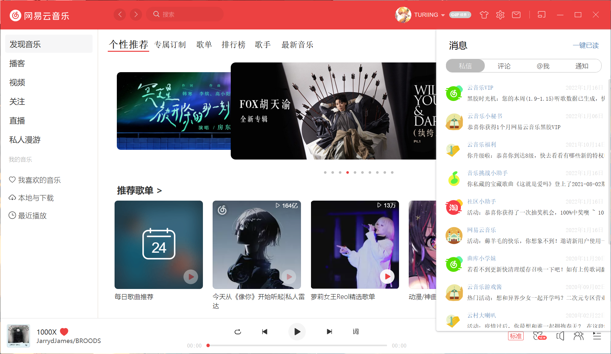
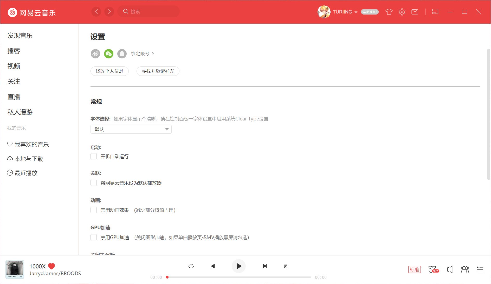
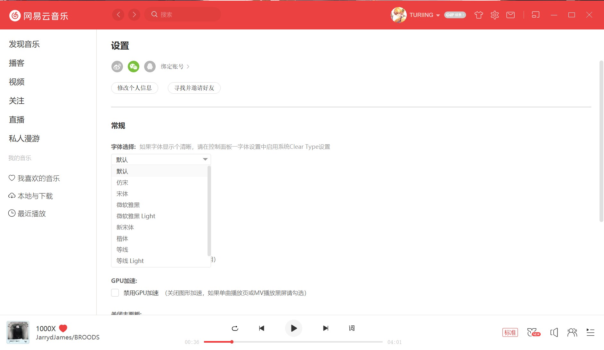
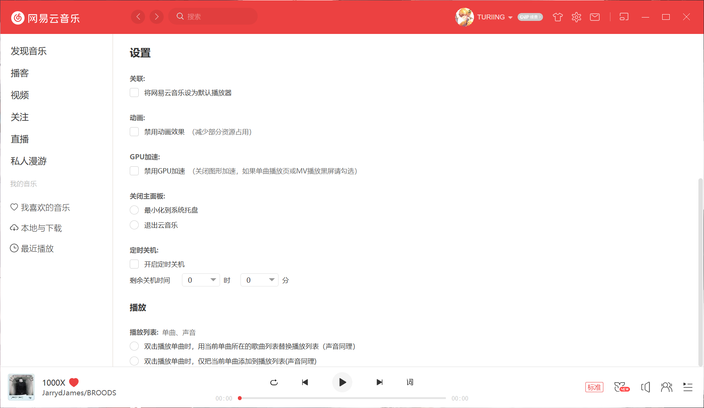
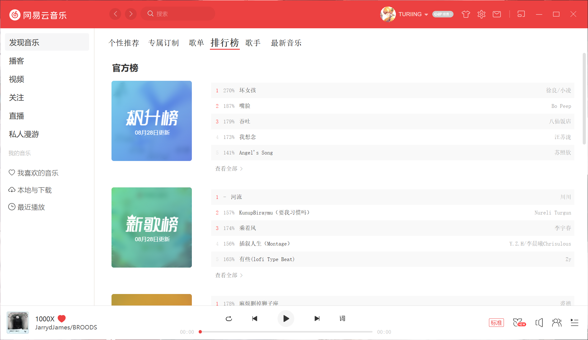
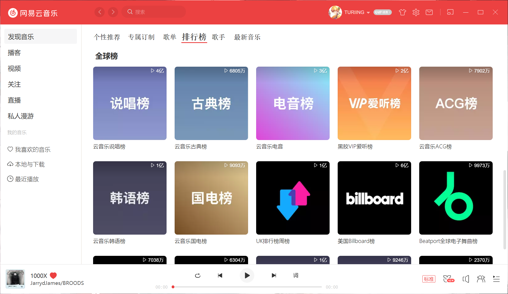
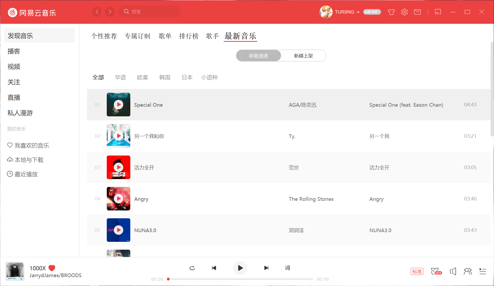
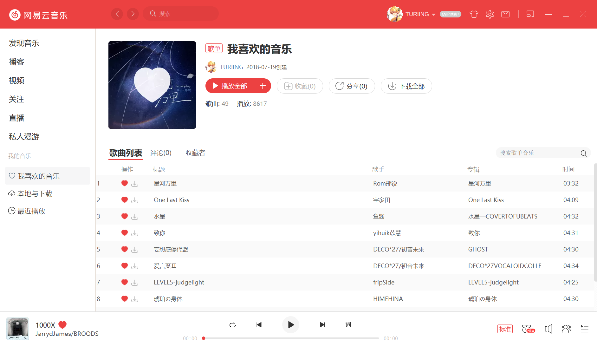
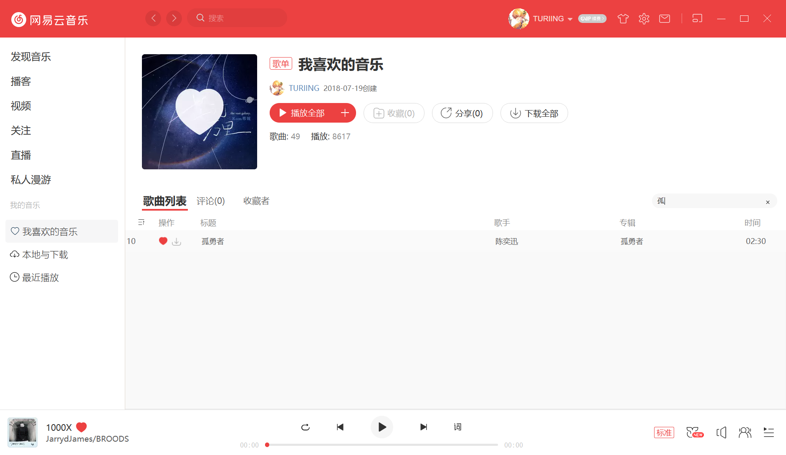

# wyy
使用Qt模仿的网易云音乐

**环境**：Clion（MinGw） + QtCreator

# 效果图

由于图片较多，若未显示，需要挂梯子

## 个性推荐页面

* 使用QGraphView + 定时器实现轮播图自动翻页
* QStackWidget + QTabWidget 实现多页面
* QGridLayout实现画廊图片显示
* 利用QSS重绘QScrollArea的滚动条

## 搜索栏Popup弹窗

* 使用事件过滤器（eventFilter）控制是否显示popup

## 个人信息弹窗

## 消息窗口

## 设置页面

* 使用QSS重绘复选框、单选框、下拉列表框等控件

## 排行榜页面

## 最新音乐

## 歌曲播放

* 使用`QMediaPlayer`实现歌曲播放
* 使用QSS重绘`QProgressBar`

## 音乐列表

* 使用`QTableView`实现音乐列表
* 使用自定义`delegate`实现自定义表格内按钮
* 使用`QSortFilterProxyModel`以及正则表达式实现表格内搜索、排序功能

